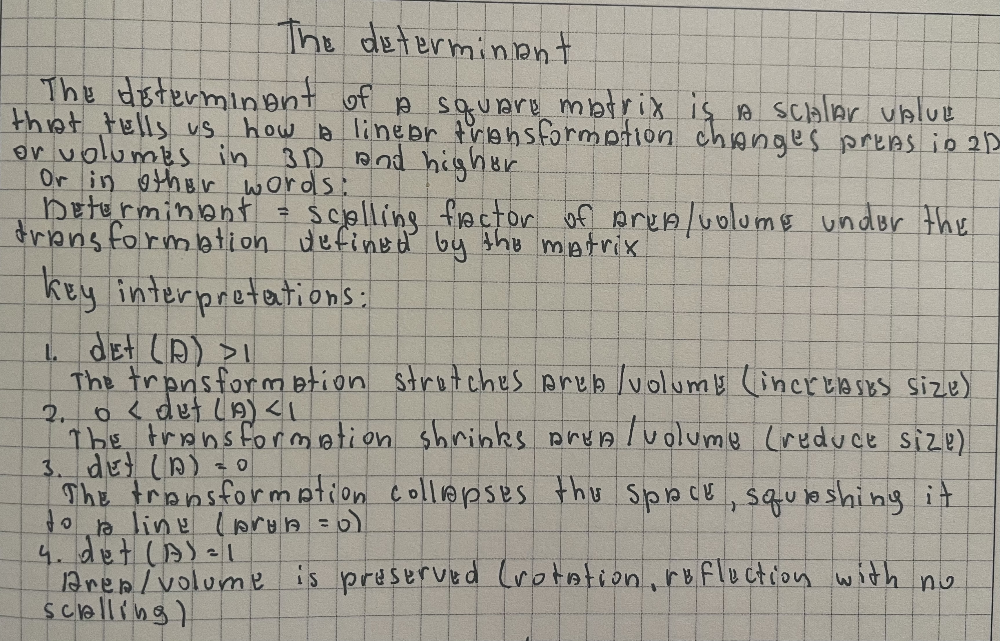
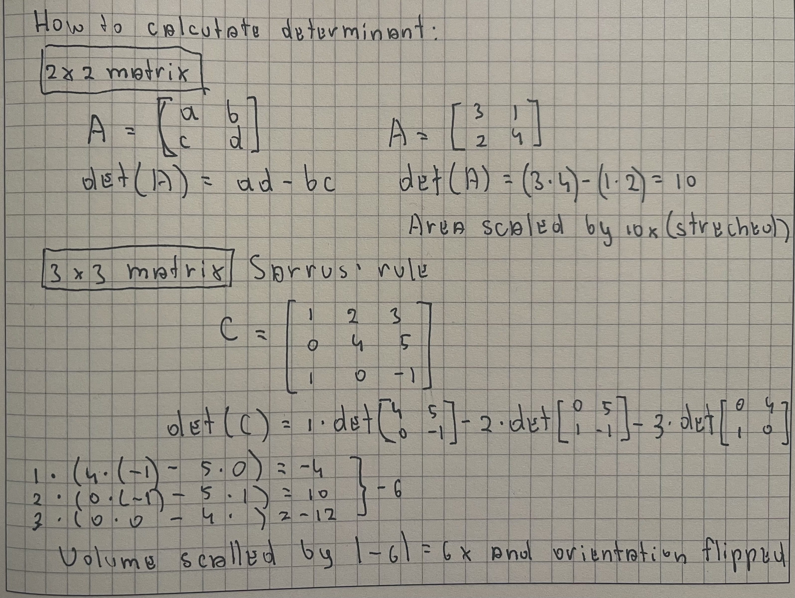

  

  

  ### Key Interpretations

| Determinant value | What happens to your rubber sheet                          | Real-life / ML analogy                                                                 | Why you should care                                                                                     |
|-------------------|------------------------------------------------------------|----------------------------------------------------------------------------------------|---------------------------------------------------------------------------------------------------------|
| **det > 1**       | The sheet gets **bigger** (area multiplies by that number) | You stretch a photo to make it larger                                                  | In ML: your data space is being **expanded**. Sometimes good (more room to separate points), sometimes bad (features become too spread out → harder to learn). |
| **0 < det < 1**   | The sheet gets **smaller** (area shrinks)                  | You squeeze a photo thumbnail                                                          | In ML: data gets **compressed**. Useful in PCA (throw away less important directions), but if too small → you lose information (e.g., important user preferences get ignored in recommendations). |
| **det = 1**       | Area stays **exactly the same** (just rotated or reflected) | You rotate or flip a photo — size doesn’t change                                       | In ML: **preserves information perfectly**. Rotations in data (e.g., changing coordinate system) don’t lose anything — very safe. Many algorithms assume or aim for this. |
| **det = 0**       | The sheet gets **squashed flat to a line** (area = 0)      | You crush a photo into a single line — all detail disappears                           | In ML: **disaster**. Means your features are redundant (multicollinearity). Linear regression crashes, neural nets get stuck, models can’t learn properly. You **must** fix this before training. |
| **det < 0**       | Area gets scaled, but the sheet is **flipped/mirrored** (inside becomes outside) | You mirror a photo left-right — looks reversed                                         | In ML: usually not a problem for prediction (models don’t care about “left vs right”). But in some cases (e.g., orientation-sensitive data like images or robotics) it matters. Mostly just means “handedness changed”. |